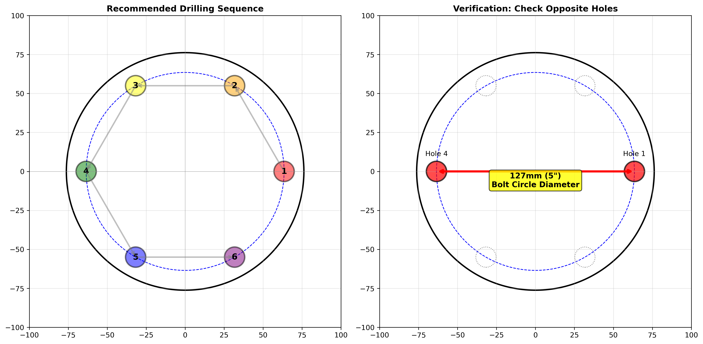

# Hexagonal coordinate calculation via radius factoring: AKA Machinists "Bolt Circle Math"

Author: Johanness A. Nilsson

## Introduction

Here is my practical approach when I need to machine parts with features equally spaced around a circle  
This might be features such as scallops, holes, or other patterns, understanding the mathematics behind  
positioning while basic, is still crucial skill that I have observed many seasoned builders still don't  
fully grok. So I wrote this tutorial to teach the fundamental principles for calculating coordinates of  
holes positioned around a circle, based on radius mathematics (trigonometry).

## Understanding the Problem

First we need to understand what problem we're trying to solve.
So, say we need to create 6 holes equally spaced around some circular part,
Say we need to machine a 152.4mm (6") end cap flange with 6 bolt holes:

- **Number of bolt holes**: 6 bolt holes (eg: M12 bolts)
- **Angular spacing**: 60° apart (360° ÷ 6 = 60°)
- **Bolt circle diameter**: 127mm (5")
- **Bolt circle radius**: 63.5mm (2.5")
- **Hole diameter**: 13mm (0.512") for M12 clearance

## Key Concept: The Hexagon Connection

When you have 6 points spaced 60° apart around a circle and connect them, you create a hexagon. This geometric relationship is the foundation for our calculations.

## Setting Up Your Coordinate System

1. **Position your part** so that one radius line aligns with a machine axis
2. **Set the X-axis** horizontally through the center
3. **Set your dials or DRO to 0,0** at the center point

## The Magic Numbers

For a 30-60-90 triangle (which appears when working with hexagons), remember these two critical values:

### 1. **0.5** (or 1/2)

- In a 30-60-90 triangle, the radius of the bolt circle is always **twice** the length of the short side
- To find the short side: multiply radius × 0.5

### 2. **0.86603**

- This is the ratio for finding the long leg of the triangle
- To find the long side: multiply radius × 0.86603
  - PRO TIP: _This value comes from sin/cos of 30°, but just memorize it!_

_Figure 2: The 30-60-90 triangle method showing how to calculate hole positions_

## Calculating Our Hole Positions

### For the first two holes (on the X-axis)

- Position 1: X = +63.5mm (+2.5"), Y = 0
- Position 2: X = -63.5mm (-2.5"), Y = 0

### For the remaining four holes

Using our 30-60-90 triangle relationships:

1. **Calculate the offsets**:

   - Short leg = 63.5mm × 0.5 = 31.75mm (1.25")
   - Long leg = 63.5mm × 0.86603 = 54.99mm (2.165")

2. **Apply the coordinates**:
   - **Hole 3**: X = +31.75mm (+1.25"), Y = +54.99mm (+2.165")
   - **Hole 4**: X = -31.75mm (-1.25"), Y = +54.99mm (+2.165")
   - **Hole 5**: X = -31.75mm (-1.25"), Y = -54.99mm (-2.165")
   - **Hole 6**: X = +31.75mm (+1.25"), Y = -54.99mm (-2.165")

## The Triangle Pattern

Now, notice how these calculations create four identical right triangles within the circle?  
Each triangle has:

- Hypotenuse = radius: 63.5mm (2.5")
- Short leg = 31.75mm (1.25")
- Long leg = 54.99mm (2.165")
- Angles: 30°, 60°, and 90°

_Figure 3: Complete layout showing all hole coordinates and the four triangular sections_

## Working Tips

1. **Material Prep**: Make sure your blank round is properly faced and centered before locating holes.

2. **Drilling Sequence**: When boring the M12 clearance holes:

   - Start with a center bore or spot drill
   - Use a 12.5mm bore for initial hole
   - Ream to final 13mm size for proper clearance

_Figure 4: Recommended drilling sequence and verification method_

3. **Efficient Movements**: When moving between holes, change only one coordinate at a time when possible. This minimizes your setup time and also will reduce errors.

4. **QA / Verification**: After cutting the first hole, rotate to position 4 (mirror opposite) and verify the dimension is exactly 127mm (5") center-to-center.

## Universal Application

This method will work for any 6-hole pattern on any diameter:

1. Calculate your radius (diameter ÷ 2)
2. Multiply by 0.5 for the short offset
3. Multiply by 0.86603 for the long offset
4. Apply the coordinate pattern shown above

### Quick Reference Table for Common Flange Sizes

| Flange Size | Bolt Circle Diameter | Radius  | Short Offset | Long Offset |
| ----------- | -------------------- | ------- | ------------ | ----------- |
| 100mm (4")  | 76.2mm (3")          | 38.1mm  | 19.05mm      | 33.00mm     |
| 150mm (6")  | 127mm (5")           | 63.5mm  | 31.75mm      | 54.99mm     |
| 200mm (8")  | 177.8mm (7")         | 88.9mm  | 44.45mm      | 76.99mm     |
| 250mm (10") | 228.6mm (9")         | 114.3mm | 57.15mm      | 98.99mm     |

## Closing Thoughts

This is the first tutorial I've done like this. I'm thinking ahead—so the next time I get asked how to do this, I've got an easy hyperlink.  
I'm sure there may be other ways to accomplish the task, this is just the way I've always approached the problem. After you've performed this operation a few times it's just like walking. You don't even have to think about it. You get a feel for the geometric relationship between a hexagon and it's circle, and really by remembering just the two _magic_ numbers `0.5` and `0.86603`, you can quickly calculate the position of any hole in a hex pattern. I like my technique because it eliminates complex trig calcs at the machine, so lame. It's just an easy and repeatable method for dead on hole positioning on flanges and similar jobs.
