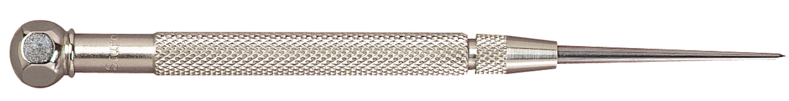

# Layout and Marking

Getting your holes in the right place the first time, will save you a lot of $$$ (broken bits, scraped parts) and frustration.
Here are some easy to implement tips that will get you a good the first time, every time.

## Marking Methods (Rough to Precise)

### Sharpie and Square - Quick and Dirty

What I use for most of my fabrication work:

**Process**:

1. Sharpie marker (medium point)
2. Speed square or combo square
3. Mark your lines
4. Eyeball the intersection

**Reality**:

- Wide line = ±1/16" accuracy at best
- Fine for most fab work
- Those fine-point markers don't last in a shop environment
- Good enough is often _good enough_

### Scribe Lines - Getting Serious

When ±1/16" won't cut it:

**Tools**:  

_Never be without a good quality pocket scribe!_

- Carbide scribe (you feel naked without it)
- Steel rule or square
- Maybe layout fluid

---

**My go-to square**:  
  
_That little combo square/machinist square hybrid:_

- Set length precisely
- Lock it down
- Scribe along the edge
- Way faster than measuring each time
- Has a built in scribe (don't loose it!)

---

### Caliper Scribing - Shop Controversial

Yeah, it makes the internet mad, but it works:

**How to**:

1. Set your dimension
2. One jaw on edge of material
3. Drag to scribe line
4. Cheap calipers work fine for this

**The problem**:

- Hard to see scribed line
- Looks like other scratches
- Easy to lose track

### Layout Fluid - Machinist Territory

When you need to see what you're doing:

**Blue dye** (Dykem or similar):

1. Clean surface
2. Apply thin coat
3. Let dry (30 seconds)
4. Scribe shows bright metal
5. Removes with acetone

**Poor man's version**:

- Jumbo Chisel Sharpie over the area
- Scribe through it
- Not as good but works
- Fills other scratches so you can track your line

## Center Punching - Don't Skip This

The difference between holes where you want them and holes where they ended up.

### Automatic Center Punch

My preference for most work:

### Automatic Center Punches

The spring-loaded ones:

**Good**:

- Consistent depth
- One-handed operation
- No hammer needed

**Bad**:

- Can slide if you aren't careful
- Tension adjustment must be appropriate for material
- Spring mechanisms can fail (Buy Starrett)

### Manual Center Punches

More accurate, but not always necessary

**Center Punching Technique**:

1. Sharp 90° point
2. Place exactly on mark
3. Light tap first (just a dimple)
4. Check position
5. Harder tap if good
6. Deep enough to guide drill

**Pro tip**: Three taps!

- First: tiny mark
- Check with magnifier if critical
- Second: working dimple
- Third: only if hand drilling

I keep a manual punch set around, but prefer the automatic punch 9 out of 10 times.

### Center Drills

Rigid spotting drills:

**When to use**:

- Machining operations
- Starting holes on lathe
- When position is critical

**For fabrication**:
Usually overkill unless you're doing precise work.

## Layout Patterns

### Single Holes

Easy mode:

1. Two perpendicular lines
2. Scribe or mark
3. Intersection is your spot
4. Center punch
5. Verify before drilling

### Bolt Patterns

This is where it gets interesting:

**Linear patterns**:

1. Mark first hole
2. Set calipers to spacing
3. Walk down the line
4. All holes in perfect spacing

**Circular patterns** (see the [bolt circle tutorials](../bolt_circle_coordinates/README.md)):

1. Find center
2. Scribe circle (if needed)
3. Calculate coordinates
4. Or use dividers for equal spacing

### Grid Patterns

For mounting plates, etc:

**Method 1 - Measure each**:

- Slow but works
- Errors accumulate
- Double-check everything

**Method 2 - Edge reference**:

- Measure from same edge
- No accumulation
- More accurate
- My preferred method

## Transferring Holes

When you need to match existing parts:

### Transfer Punches

Best method for accuracy:

1. Align parts
2. Clamp together
3. Transfer punch through holes
4. Perfect centers transferred

### Pencil Rubbing

Quick and dirty:

1. Paper over part
2. Rub with pencil
3. Shows hole locations
4. Good for rough work

### Direct Marking

When parts nest together:

1. Clamp in position
2. Drill through both
3. Or mark through with scribe
4. Works for one-offs

## Common Mistakes

### Over-Marking

- Too many lines confuse your monkey brain
- Mark only what you need
- Clean layout = fewer errors

### Under-Punching

- Light dimple = walking drill
- Make it deep enough
- But not so deep it distorts

### Wrong Reference

- Always measure from same edge
- Don't flip references
- Consistency prevents errors

### Trusting Your Layout

- Measure twice
- Check with different tool
- Verify before cutting
- **"Measure twice, drill once"**

## Tools You Actually Need

### Must Have

- 6" rule (good quality)
- Carbide scribe
- Center punch
- Small square
- Sharpie markers

### Nice to Have

- Layout fluid
- Height gauge
- Surface plate
- Dividers
- Transfer punch set

### Overkill for Most

- Optical center punch
- Vernier height gauge
- Granite surface plate
- Digital protractor

## Shop Reality

For 90% of fab work:

1. Sharpie and square
2. Center punch
3. Double-check critical dimensions
4. Send the hole home

For precision work:

1. Layout fluid
2. Proper tools
3. Take your time
4. Check everything twice

Remember: Time spent on layout is never time wasted. It's way faster to mark it right than to remake the part.

